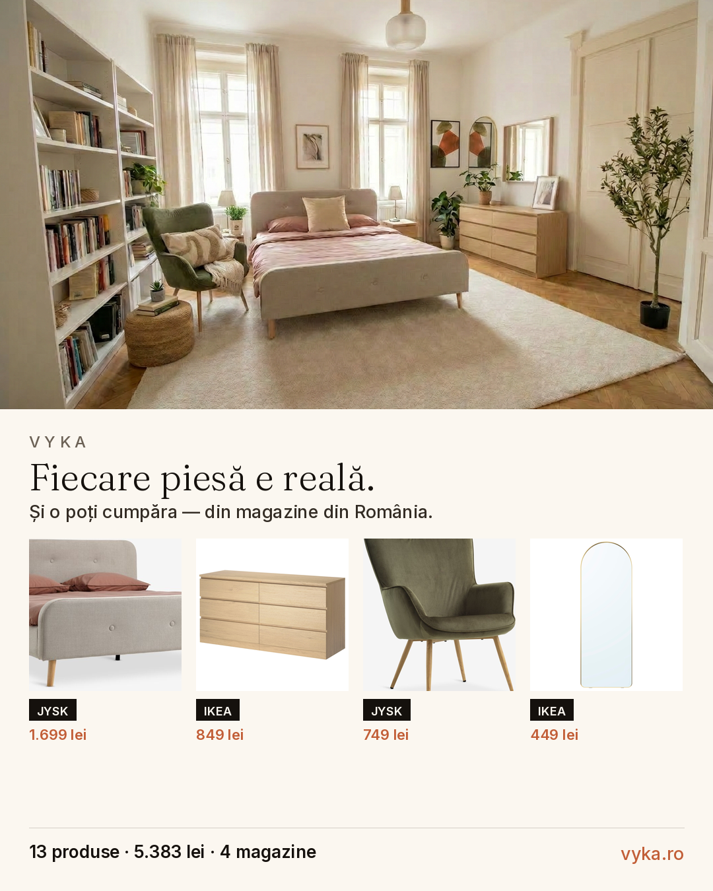

# Vyka — Marketing Assets

Social-media assets for [vyka.ro](https://vyka.ro). Generated from real design
executions; text overlaid with the site's exact brand type (Fraunces + Inter)
and palette (cream `#FBF7F0`, ink `#15110D`, terracotta `#C25E37`).

Permanent raw URLs: `https://raw.githubusercontent.com/tudor2004/vyka-marketing/main/out/<file>`

## Assets — design `ee0fa358` (dormitor scandinavian)

| File | Format | Use |
|------|--------|-----|
| `out/ee_shoppable_4x5.png` | 1080×1350 | **USP card** — room + real products (store + price). IG/FB feed |
| `out/ee_ba_9x16.png` | 1080×1920 | Before/after — IG/FB Stories, TikTok |
| `out/ee_hero_9x16.png` | 1080×1920 | Hero (after + CTA) — Stories/Reels cover |
| `out/ee_ba_4x5.png` | 1080×1350 | Before/after — IG/FB feed |
| `out/ee_reveal.gif` | 540×960 | Before→after wipe (preview; final mp4 encoded off-box) |

`src/` holds the source before/after + product list. `*.py` regenerate everything
(`brand.py` = exact site tokens). Fonts are git-ignored — refetch from Google Fonts
(Fraunces 300 + Inter 500/600).

## Preview

